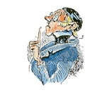

A Review of German Grammar
=======

by [Bruce Duncan](http://german.dartmouth.edu/people/bruce-duncan)

| Nouns & Pronouns                  | Verb Tenses     | Moods, Voices, etc. | Word Order                  | Modifiers             | Other Features       |
| :-------------------------------- | :-------------- | :------------------ | :-------------------------- | :-------------------- | :------------------- |
| [Gender](nouns/gender.md)         | Present         | Imperative          | Word Order in  Main Clauses | Adjective Endings     | Modal Auxiliaries    |
| [Nominative](nouns/nominative.md) | Simple Past     | Passive             | Questions                   | Comparatives          | Word Formation       |
| Accusative                        | Present Perfect | Reflexives          | Relative Clauses            | Time Expressions      | Negations            |
| Dative                            | Past Perfect    | Subjunctive II      | Dependent Clauses           | Extended Modifiers    | Separable Prefixes   |
| Genitive                          | Future          | Subjunctive I       | Infinitive Clauses          | Prepositions          | Inseparable Prefixes |
| Adjectival Nouns                  | Future Perfect  |                     | Compound Sentences          | Augmentative Prefixes | Compound Words       |
|                                   | Strong Verbs    | Lassen              |                             |                       | Foriegn Words        |
|                                   |                 |                     |                             |                       | Abbreviations        |

> With thanks to Konrad Kenkel, Christopher Schnader - and, above all, to Gesine Voeste-Scherer

[German Studies At Dartmouth](http://german.dartmouth.edu/)