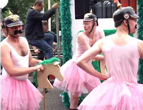
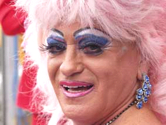

The Gender of German Nouns (das Genus)
=======

Grammatical gender and sex have little to do with one another. The terms "masculine", "feminine" and "neuter" are conventions for grammarians, not biologists. Even after recognizing that, learners of German will soon discover that common sense is still not always a good guide in figuring out whether a noun is der, die, or das. Mostly, you just have to learn a noun's gender (and plural) along with the word itself.

There are, however, a few categories that might be of help.

Masculine
------

- **male humans and animals:** der Mann [man], König [king], Vater [father], Löwe [lion], Bär [bear]
- **days, months, seasons of the year, points of the compass:** der Sonntag [Sunday], März [March], Herbst [autumn], Osten [East] *But:* das Jahr [year], die Woche [week] (but: der Mittwoch [Wednesday])
- **forms of precipitation, kinds of wind:** der Regen [rain], Schnee [snow], Hagel [hail], Föhn [föhn], Monsun [monsoon], Orkan [hurricane].
- **five words ending in -ee:** der Kaffee [coffee], Klee [clover], Schnee [snow], Tee [tea], See [lake] (but note: die See [sea])
- **most nouns that are derived from strong verbs but have no suffix:** der Kauf [purchase], Wurf [throw], Sprung [jump], Riss [rip], Gang [gait]. Exception: das Schloss [lock; castle]
- **most nouns ending in the suffixes -er, -el, -ling:** der Lehrer [teacher], Wecker [alarm clock], Fremdling [stranger], Feigling [coward], Schlüssel [key]. *But:* die Trommel [drum], die Butter [butter], das Fenster [window], die Schwester [sister], die Mutter [mother], das Wetter [weather], das Zimmer [room]
- **most nouns ending in -en:** der Boden [floor; ground; soil], Regen [rain], Wagen [car; wagon].
- **nouns with the suffixes -ant, -ar, -är, -ent, -eur, -ier, -ist, -or, -ismus:** der Spekulant [speculator], Kommissar [commissar], Volontär [trainee], Friseur [barber], Student [student], Offizier [officer], Tourist [tourist], Lektor [(publisher's) editor; adjunct teacher], Kapitalismus [capitalism].
- **brands of car:** der Mercedes, Porsche, Ford

Neuter
-----

- **many offspring of humans and animals:** das Kind [child], Kalb [calf], Küken [chick], Lamm [lamb].
- names of animals that include both male and female: das Pferd [horse], Schwein [pig], Schaf [sheep]. *But:* der Fisch [fish], der Hund [dog], die Maus [mouse], die Schlange [snake]
- **names of cities, continents, and most countries:** das alte Berlin [old Berlin], Asien [Asia], Frankreich [France]. *But:* der Irak, der Iran, der Libanon; die Schweiz [Switzerland]; and countries ending in -ei: die Türkei [Turkey]. For more information on using articles with geographic locations, see [this page](http://faql.de/grammatik.html#geo).
- **metals und chemical elements:** das Gold [gold], Silber [silver], Eisen [iron], Blei [lead], Chrom [chromium], Uran [uranium]. *But:* der Stahl [steel], der Schwefel [sulphur], die Bronze [bronze]
- **all words that are from other parts of speech that are used as nouns but do not signify people:** das Essen [food; meal], Leben [life], Rauchen [smoking], das Ich [ego], das Schöne [Beauty; the Beautiful], das Wenn und Aber [if and but], das Blaue [blue yonder], das A und das O [the alpha and omega].
- **collective nouns:** das Volk [folk], Gebirge [(group of) mountains], Besteck [cutlery], Geschirr [crockery, dishes]. *But:* der Gesang [song, singing].
- **numbers when they indicate a set (of people, years, etc.):** das Duo [duet], das Quintett [quintet], das Jahrzehnt [decade], das Dutzend [dozen], das Jahrhundert [century], das Jahrtausend [millenium].
- **nouns with the suffixes -chen, -lein and -sel:** das Mädchen [girl], Fräulein [Miss], Rätsel [puzzle].
- **nouns with the suffixes -ett, -ment and -um:** das Ballett [ballet], Sonnett [sonett], Sakrament [sacrament], Parlament [parliament], Neutrum [neuter], Helium [helium].

Feminine
------

*The future is feminine, and so is the past!*

- **female humans and animals, often with -in:** die Frau [woman], Tochter [daughter], Kuh [cow], Lehrerin [teacher], Ärztin [doctor], Wölfin [she-wolf].
- **numbers and digits:** die Eins [1], die Siebzehn [17], die Zweiundzwanzig [22]. *But:* see above concerning sets.
- **names of ships and airplanes:** die Bismarck, die Europa, die Boeing.
- **a great many words that end in -e:** die Wanne [tub], Birne [pear], Tasse [cup], Zahnbürste [toothbrush], Wiese [meadow]. *But:* some are masculine: der Name [name], Junge [boy], Löwe [lion], Hase [rabbit, hare], Käse [cheese].
- **all with the suffixes -ei, -heit, -keit, -schaft, -t, -ung:** die Bäckerei [bakery], Krankheit [disease], Freundlichkeit [friendliness], Gesellschaft [society; company], Fahrt [trip], Wohnung [apartment; abode]. *But:* der Sprung [jump (Here the "ung" is not a suffix; the noun comes from the verb "springen")].
- **all with the suffixes -age, -enz, -esse, -euse, -ie, -ik, -ion, -itis, -tät, -ur usw.:** die Reportage [report], Lizenz [license], Delikatesse [delicacy], Friseuse [female barber], Melodie [melody], Politik [politics, policy], Nation [nation], Gastritis [gastritis], Universität [university], Natur [nature].

Controversies
-----

There are even some nouns about which native speakers don't agree. Some differences are regional. In Austria and Upper Bavaria, for example, it is possible to say "der Radio," rather than "das". Sometimes the importation of a new word into the language creates uncertainty. For a discussion of some of these problems, see [this page](http://faql.de/genus.html).

Related Topics
------

- Nominative
- Accusative
- Dative
- Genitive
- Adjectival Nouns
- Adjective Endings
- Suffixes