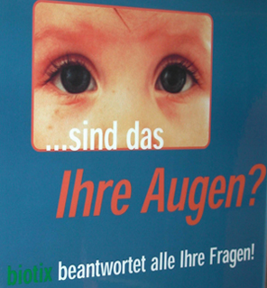
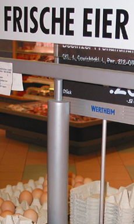
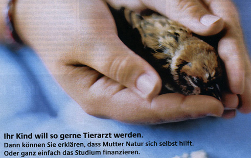
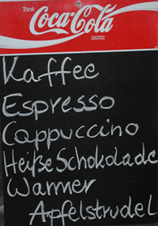

The Nominative Case (der Nominativ)
======

In English
------

In standard English, the subject of a sentence is in the nominative case, which is marked either by word order or by certain forms of personal pronoun (I, we, he, she, and they). Thus the difference between "Dog bites man" and "Man bites dog" is clear, as is the difference between "I see her" and "She sees me."

There is also an official "predicate nominative," although it is rarely used in colloquial speech: "It is I," "If I were she."

*Are those your eyes? Biotix answers all your questions.*
*[Ad for paternity tests]*

In German
------

German marks case in a variety of ways, with word order being the least important. The nominative personal pronouns are:

`ich = I` - `wir = we`
`du = you` - `ihr = y'all`

`...` - `Sie = you`

`er = he`
`sie = she` - `sie =they`
`es = it`

Four further nominative pronouns are man, jemand, keiner, and wer:

- **Man sagt das nicht.** [One doesn't say that.]
- **Das kann man nie wissen.** [One can never know that.]
- **Jemand soll ihr helfen.** [Someone should help her.]
- **Ihn kennt keiner.** [No one knows him.]
- **Wer wohnt hier?** [Who lives here?]
- **Ich weiß nicht, wer das gesagt hat.** [I don't know who said that.]

Articles and adjective endings also mark the nominative case. Note that the adjective endings depend not only on gender, but also on whether they follow a "der-word," an "ein-word" or no article at all.

Note: The so-called "der-words" are the articles der, die, das; dies-, jed-, jen-, manch-, solch-, welch-. The "ein-words" are ein, kein, and the possessive pronouns: mein, dein, sein, ihr, unser, euer, Ihr, ihr.

| Masculine        | Feminine         | Neuter          | Plural             |
| ---------------- | ---------------- | --------------- | ------------------ |
| der rote Stuhl   | die neue Lampe   | das alte Buch   | die roten Stühle   |
| kein roter Stuhl | keine neue Lampe | kein altes Buch | keine neuen Lampen |
| roter Stuhl      | neue Lampe       | altes Buch      | alte Bücher        |

The nominative case settings
-----

The nominative case is used in five settings

- To designate the subject of a sentence:

  - **Ein Unglück kommt selten allein.** [It never rains but it pours.]
  - **Irren ist menschlich.** [To err is human.]
  - **Stille Wasser sind tief.** [Still waters run deep.]
  - **Neue Besen kehren gut.** [New brooms sweep clean.]
  - **Das Leben ist kurz.** [Life is short.]

- As a predicate nominative - or, thought of in another way, as the "object" of the verbs sein, werden, and bleiben:

  - **Sie ist ein kleines Kind.** [She's a small child.]
  - **Er ist mein vierter Mann geworden.** [He became my fourth husband.]
  - **Er bleibt mein bester Freund.** [He remains my best friend.]

*Your child wants so much to become a veterinarian. You could explain that Mother Natur helps herself. Or simply finance [your child's] schooling.*

- As a citation form (e.g. a dictionary entry or a label).

Hint: this does not mean that the nominative is a noun's natural state, nor does it imply that the nominative is the default case. Citing in the nominative is simply a convention, adopted in part because the nominative definite articles are unambiguous with respect to gender: der Stuhl, die Lampe, das Buch.

- When addressing someone:

  - **Junger Mann, geben Sie das sofort zurück!** [Young man, give that right back!]
  - **Liebe Oma, Dein Brief ist endlich angekommen.** [Dear Grandma, your letter finally arrived.]

- In certain exclamations:

  - **Du meine Güte!** [For heaven's sake!]
  - **Ach du lieber Gott!** [Oh my God!]
  - **Ich Idiot!** [I'm such an idiot!]

